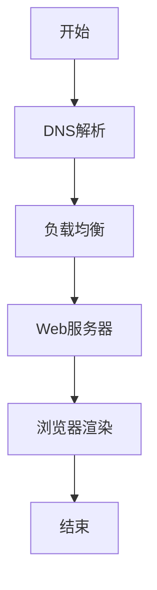

### 面试必问的问题

[toc]

#### 1. 数据结构和算法

排序、搜索（查找）

##### 红黑树、B树

无论红黑还是 B 树, 都是用来解决搜索问题的, 搜索越快越好嘛。其实最初的, 就是二叉搜索树。如果这颗树比较平衡的话, 其搜索效率就等同于二分查找了。

但是呢? 现实是, 二叉搜索树不平衡, 如果不平衡, 你想想, 搜索效率就很差了

所以呢? 能不能构建二叉搜索树时能让它尽量平衡一些?于是就有了平衡二叉搜索树.

但是呢, 平衡二叉搜索树插入删除比较麻烦. 为了这种平衡, 付出代价太大(如果你就创建一次, 不经常变动也没事, 反正只有变动时才有代价)

为了即要平衡, 又不想付出太大代价, 就有了红黑树了

当然, 红黑树消除了插入删除的代价, 所以, 对于 HashMap 的某一个 bucket, 如果元素很多, 使用红黑树是很适合了.(因为 HashMap 一般经常要删除和修改)

到了这里, 红黑树还是二叉树, 层还是比较深的, 和搜索的过程是和层的深度是有关的, 每一次要到某一层的节点加载到内存来比较.

如果所有数据都在内存没问题, 但数据要是在磁盘呢? 每加载一次就是从磁盘到内存的一次 IO, 你也知道, 磁盘读写是很慢的. 所以能不能尽量减少这种 IO 呢?

B 树就可以了, B 树不是二叉树, B 树是一种多叉搜索树, 每一个节点都有多个元素.

这样, 对于全部节点固定情况下, B 树肯定比红黑树要浅了, 这样, 潜在的最大 IO 次数一定少了啊.

所以 B 树就应用在数据库的场景下.

同理, 如果你的搜索涉及到多种速度不一的存储介质, 也是可以考虑 B 树的.

#### 2. 操作系统

##### 指针和引用

1) 引用必须被初始化，指针不必。
2) 引用初始化以后不能被改变，指针可以改变所指的对象。
3) 不存在指向空值的引用，但是存在指向空值的指针。

##### 进程线程区别

**区别：**

- 进程是资源分配的最小单位，线程是程序执行的最小单位（资源调度的最小单位）
- 进程有自己的独立地址空间，每启动一个进程，系统就会为它分配地址空间，建立数据表来维护代码段、堆栈段和数据段，这种操作非常昂贵。而线程是共享进程中的数据的，使用相同的地址空间，因此CPU切换一个线程的花费远比进程要小很多，同时创建一个线程的开销也比进程要小很多。
- 线程之间的通信更方便，同一进程下的线程共享全局变量、静态变量等数据，而进程之间的通信需要以通信的方式（IPC)进行。不过如何处理好同步与互斥是编写多线程程序的难点。
- 但是多进程程序更健壮，多线程程序只要有一个线程死掉，整个进程也死掉了，而一个进程死掉并不会对另外一个进程造成影响，因为进程有自己独立的地址空间。

**进程与线程的资源**

- 线程共享：进程代码段、进程的公有数据(利用这些共享的数据，线程很容易的实现相互之间的通讯)、进程打开的文件描述符、信号的处理器、进程的当前目录和进程用户ID与进程组ID。
- 线程独有：栈（保存其运行状态和局部自动变量）、程序计数器。

**进程与线程的同步**

- 进程：无名管道、有名管道、信号、共享内存、消息队列、信号量
- 线程：互斥量、读写锁、自旋锁、线程信号、条件变量

**僵尸进程**

- 定义：一个进程使用fork创建子进程，如果子进程退出，而父进程并没有调用wait或者waitpid获取子进程的状态信息，那么子进程的进程描述符等一系列信息还会保存在系统中。这种进程称之为僵死进程。

- 危害：在Unix系统管理中，当用ps命令观察进程的执行状态时，经常看到某些进程的状态栏为defunct，这就是所谓的“僵尸”进程。“僵尸”进程是一个早已死亡的进程，但在进程表（processs table）中仍占了一个位置（slot）。由于进程表的容量是有限的，所以，defunct进程不仅占用系统的内存资源，影响系统的性能，而且如果其数目太多，还会导致系统瘫痪。

- 处理方法：

- - 改写父进程，在子进程死后要为它收尸。具体做法是接管SIGCHLD信号。子进程死后，会发送SIGCHLD信号给父进程，父进程收到此信号后，执行waitpid()函数为子进程收尸。这是基于这样的原理：就算父进程没有调用wait，内核也会向它发送SIGCHLD消息，尽管默认处理是忽略，如果想响应这个消息，可以设置一个处理函数。
  - 把父进程杀掉。父进程死后，僵尸进程成为”孤儿进程”，过继给1号进程init，init始终会负责清理僵尸进程．它产生的所有僵尸进程也跟着消失。

**孤儿进程**

- 父进程运行结束，但子进程还在运行(未运行结束)的子进程就称为孤儿进程。孤儿进程最终会被init进程(进程号为1)所收养，因此init进程此时变成孤儿进程的父进程，并由init进程对它们完成状态收集工作。（linux下，init是内核启动的第一个用户级进程，init有许多很重要的任务，比如像启动getty（用于用户登录）、实现运行级别、以及处理孤立进程。）

##### 内存操作（释放内存，申请内存）

##### 进程同步

1. 临界区：对临界资源进行访问的那段代码称为临界区。

2. 同步与互斥

   - 同步：多个进程因为合作产生的直接制约关系，使得进程有一定的先后执行关系。
   - 互斥：多个进程在同一时刻只有一个进程能进入临界区

3. 信号量（pv操作，当mutex=1，就是互斥）

   ```java
   typedef int semaphore;
   semaphore mutex = 1;
   void P1() {
       down(&mutex);
       // 临界区
       up(&mutex);
   }
   
   void P2() {
       down(&mutex);
       // 临界区
       up(&mutex);
   }
   ```

   

4. 管程：使用信号量机制实现的生产者消费者问题需要客户端代码做很多控制，而管程把控制的代码独立出来，不仅不容易出错，也使得客户端代码调用更容易。

   > 管程引入了 **条件变量** 以及相关的操作：**wait()** 和 **signal()** 来实现同步操作。对条件变量执行 wait() 操作会导致调用进程阻塞，把管程让出来给另一个进程持有。signal() 操作用于唤醒被阻塞的进程。

##### 经典的同步问题

1. 哲学家进餐
2. 读者-写者问题

##### 进程间的通信方式

**进程同步与进程通信很容易混淆，它们的区别在于：**

- **进程同步**：控制多个进程按一定顺序执行；
- **进程通信**：进程间传输信息。

进程通信是一种手段，而进程同步是一种目的。也可以说，为了能够达到进程同步的目的，需要让进程进行通信，传输一些进程同步所需要的信息

1. 管道

2. FIFO 命名管道，去除额里管道只能在父子进程中使用的限制

3. 消息队列

   - 可以独立于读写进程存在，从而避免了FIFO 中同步管道的打开和关闭时可能产生的困难；
   - 避免了 FIFO 的同步阻塞问题，不需要进程自己提供同步方法；
   - 读进程可以根据消息类型有选择地接收消息，而不像 FIFO 那样只能默认地接收。

4. 信号量：一个计数器，用于为多个进程提供对共享数据对象的访问

5. 共享存储

   > 允许多个进程共享一个给定的存储区。因为数据不需要在进程之间复制，所以这是最快的一种 IPC。
   >
   > 需要使用信号量用来同步对共享存储的访问。
   >
   > 多个进程可以将同一个文件映射到它们的地址空间从而实现共享内存。另外 XSI 共享内存不是使用文件，而是使用内存的匿名段。

6. 套接字

   与其他通信机制不同的是，它可用于不同机器间的进程通信。

##### 什么是死锁，有哪些必要条件

所谓死锁，是指多个进程循环等待它方占有的资源而无限期地僵持下去的局面。很显然，如果没有外力的作用，那麽死锁涉及到的各个进程都将永远处于封锁状态。

- 互斥：每个资源要么已经分配给了一个进程，要么就是可用的。
- 占有和等待：已经得到了某个资源的进程可以再请求新的资源。
- 不可抢占：已经分配给一个进程的资源不能强制性地被抢占，它只能被占有它的进程显式地释放。
- 环路等待：有两个或者两个以上的进程组成一条环路，该环路中的每个进程都在等待下一个进程所占有的资源。

##### 避免死锁

- 鸵鸟策略
- 死锁检测与死锁恢复
- 死锁预防
  - 破坏互斥条件
  - 破坏占有和等待条件
  - 破坏不可抢占条件
  - 破坏环路等待：给资源统一编号，进程只能按编号顺序来请求资源
- 死锁避免

##### 虚拟内存

虚拟内存的目的是为了让物理内存扩充成更大的逻辑内存，从而让程序获得更多的可用内存。

为了更好的管理内存，操作系统将内存抽象成地址空间。每个程序拥有自己的地址空间，这个地址空间被分割成多个块，每一块称为一页。这些页被映射到物理内存，但不需要映射到连续的物理内存，也不需要所有页都必须在物理内存中。当程序引用到不在物理内存中的页时，由硬件执行必要的映射，将缺失的部分装入物理内存并重新执行失败的指令。

> 从上面的描述中可以看出，虚拟内存允许程序不用将地址空间中的每一页都映射到物理内存，也就是说一个程序不需要全部调入内存就可以运行，这使得有限的内存运行大程序成为可能。例如有一台计算机可以产生 16 位地址，那么一个程序的地址空间范围是 0~64K。该计算机只有 32KB 的物理内存，虚拟内存技术允许该计算机运行一个 64K 大小的程序。

##### 段页式

虚拟内存采用的是分页技术，也就是将地址空间划分成固定大小的页，每一页再与内存进行映射。

程序的地址空间划分成多个拥有独立地址空间的段，每个段上的地址空间划分成大小相同的页。这样既拥有分段系统的共享和保护，又拥有分页系统的虚拟内存功能。

##### 分页分段的比较

- 对程序员的透明性：分页透明，但是分段需要程序员显式划分每个段。
- 地址空间的维度：分页是一维地址空间，分段是二维的。
- 大小是否可以改变：页的大小不可变，段的大小可以动态改变。
- 出现的原因：分页主要用于实现虚拟内存，从而获得更大的地址空间；分段主要是为了使程序和数据可以被划分为逻辑上独立的地址空间并且有助于共享和保护。

##### CPU操作

缓冲技术：协调CPU和外设之间的速度不匹配，在外设端设置高速存储硬件。

缓存技术：***协调CPU和内存之间的速度不匹配，内存协调辅存和***之间的速度不配。

DMA技术：协调主存和辅存之间的速度不匹配。

SPOOLING技术：将独占设备虚拟为共享设备，减少IO等待。

#### 3. 计算机网络

##### 3.1 五层协议

- **物理层**：考虑的是怎样在传输媒体上传输数据比特流，而不是指具体的传输媒体。物理层的作用是尽可能屏蔽传输媒体和通信手段的差异，使数据链路层感觉不到这些差异。

- **数据链路层**：网络层针对的还是主机之间的数据传输服务，而主机之间可以有很多链路，链路层协议就是为同一链路的主机提供数据传输服务。数据链路层把网络层传下来的分组封装成**帧**。

- **网络层**：为主机提供数据传输服务。而传输层协议是为主机中的进程提供数据传输服务。网络层把传输层传递下来的报文段或者用户数据报封装成**分组**。

  > IP、ARP地址解析协议(IP得到MAC)、国际控制报文协议ICMP(差错报告报文、询问报文)

- **传输层**：为进程提供通用数据传输服务。由于应用层协议很多，定义通用的传输层协议就可以支持不断增多的应用层协议。运输层包括两种协议：传输控制协议 TCP，提供面向连接、可靠的数据传输服务，数据单位为报文段；用户数据报协议 UDP，提供无连接、尽最大努力的数据传输服务，数据单位为用户数据报。TCP 主要提供完整性服务，UDP 主要提供及时性服务。

- **会话层**（五层里没有）：建立及管理会话。(端口号：传输端口与接收端口)，建立数据传输的通路。主要在系统之间发起会话或者接受会话请求，设备之间需要互相认识可以是IP也可以是MAC或者主机名。

- **表示层**（五层里没有）：数据压缩、加密以及数据描述，这使得应用程序不必关心在各台主机中数据内部格式不同的问题。

- **应用层**：为特定应用程序提供数据传输服务，例如 HTTP、DNS 等协议。数据单位为**报文**。

| OSI七层网络模型      | TCP/IP四层概念模型 | 对应网络协议                                                 |
| -------------------- | ------------------ | ------------------------------------------------------------ |
| 应用层               | 应用层             | **HTTP**/TFTP/**FTP**（文件传输）/NFS/WAIS/**SMTP**（电子邮件） |
| 表示层               | 应用层             | Telnet/Rlogin/SNMP/Gopher                                    |
| 会话层               | 应用层             | **SMTP**/DNS                                                 |
| 传输层/报文段        | 传输层             | TCP/UDP                                                      |
| 网络层/分组/数据报文 | 网络层             | **IP/ICMP/ARP**/RARP/AKP/UUCP                                |
| 数据链路层/帧        | 数据链路层         | FDDI/PPP/PDN                                                 |
| 物理层/比特流        | 数据链路层         |                                                              |

**数据在各层中的传递过程：**

在向下的过程中，需要添加下层协议所需要的首部或者尾部，而在向上的过程中不断拆开首部和尾部。

路由器只有下面三层协议，因为路由器位于网络核心中，不需要为进程或者应用程序提供服务，因此也就不需要传输层和应用层。

##### tcp&udp

- TCP的主要特点是：

- - 面向连接。
  - 每一条TCP连接只能是点对点的（一对一）。
  - 提供可靠交付的服务(无差错，不丢失，不重复，且按序到达)(校验和、重传控制、序号标识、滑动窗口、确认应答实现可靠传输。如丢包时的重发控制，还可以对次序乱掉的分包进行顺序控制。)。
  - 提供全双工通信。
  - 面向字节流。

- UDP的主要特点是：

- - 无连接。
  - 尽最大努力交付(不保证可靠交付)。
  - 面向报文。
  - 无拥塞控制。
  - 支持一对一、一对多、多对一和多对多的交互通信。
  - 首部开销小（只有四个字段：源端口、目的端口、长度、检验和）。

采用TCP，一旦发生丢包，TCP会将后续的包缓存起来，等前面的包重传并接收到后再继续发送，延时会越来越大。

UDP对实时性要求较为严格的情况下，采用自定义重传机制，能够把丢包产生的延迟降到最低，尽量减少网络问题对游戏性造成影响。

##### tcp 握手

假设 A 为客户端，B 为服务器端。

- 首先 B 处于 LISTEN（监听）状态，等待客户的连接请求。
- A 向 B 发送连接请求报文，SYN=1，ACK=0，选择一个初始的序号 x。
- B 收到连接请求报文，如果同意建立连接，则向 A 发送连接确认报文，SYN=1，ACK=1，确认号为 x+1，同时也选择一个初始的序号 y。
- A 收到 B 的连接确认报文后，还要向 B 发出确认，确认号为 y+1，序号为 x+1。
- B 收到 A 的确认后，连接建立。


**三次握手的原因**

第三次握手是为了防止失效的连接请求到达服务器，让服务器错误打开连接。

客户端发送的连接请求如果在网络中滞留，那么就会隔很长一段时间才能收到服务器端发回的连接确认。客户端等待一个超时重传时间之后，就会重新请求连接。但是这个滞留的连接请求最后还是会到达服务器，如果不进行三次握手，那么服务器就会打开两个连接。如果有第三次握手，客户端会忽略服务器之后发送的对滞留连接请求的连接确认，不进行第三次握手，因此就不会再次打开连接。

##### 四次挥手


以下描述不讨论序号和确认号，因为序号和确认号的规则比较简单。并且不讨论 ACK，因为 ACK 在连接建立之后都为 1。

- A 发送连接释放报文，FIN=1。客户端（A）进入 FIN_WAIT_1状态；
- B 收到之后发出确认ack，此时 TCP 属于半关闭状态（CLOSE_WAIT），B 能向 A 发送数据但是 A 不能向 B 发送数据。
- 当 B 不再需要连接时，发送连接释放报文，FIN=1，用来关闭Server到Client的数据传送，服务端进入LAST_ACK状态。
- A 收到FIN后发出确认，进入 TIME-WAIT 状态，等待 2 MSL（最大报文存活时间）后释放连接，发送一个ACK给服务端，ack为上一个FIN+1。
- B 收到 A 的确认后释放连接。

##### 三次握手的原因

“为了防止已失效的连接请求报文段突然又传送到了服务端，因而产生错误”（主要目的防止server端一直等待浪费资源）

可能第一次”我要建立连接“滞留了，本已失效但server收到这个失效的连接以为是新的连接，于是同意连接，但此时其实没有，如果没有三次握手，server就会白白等待，浪费资源。

**四次挥手的原因**

客户端发送了 FIN 连接释放报文之后，服务器收到了这个报文，就进入了 CLOSE-WAIT 状态。这个状态是为了让服务器端发送还未传送完毕的数据，传送完毕之后，服务器会发送 FIN 连接释放报文。

**TIME_WAIT**

客户端接收到服务器端的 FIN 报文后进入此状态，此时并不是直接进入 CLOSED 状态，还需要等待一个时间计时器设置的时间 2MSL。这么做有两个理由：

- 确保最后一个确认报文能够到达。如果 B 没收到 A 发送来的确认报文，那么就会重新发送连接释放请求报文，A 等待一段时间就是为了处理这种情况的发生。
- 等待一段时间jh是为了让本连接持续时间内所产生的所有报文都从网络中消失，使得下一个新的连接不会出现旧的连接请求报文。

##### http和https的区别，https如何保证加密传输

- https协议需要到CA（Certificate Authority，证书颁发机构）申请证书，一般免费证书较少，因而需要一定费用。

- http是超文本传输协议，信息是明文传输，https则是具有安全性的ssl加密传输协议。

- http和https使用的是完全不同的连接方式，用的端口也不一样，前者是80，后者是443。

- http的连接很简单，是无状态的。Https协议是由SSL+Http协议构建的可进行加密传输、身份认证的网络协议，比http协议安全。(无状态的意思是其数据包的发送、传输和接收都是相互独立的。无连接的意思是指通信双方都不长久的维持对方的任何信息。)

ssl保证加密传输：私钥和公钥

1. 机密性
2. 防伪造
3. 防欺骗

##### SSL/TLS握手詳細過程


1. **"client hello"消息：**客户端通过发送"client hello"消息向服务器发起握手请求，该消息包含了客户端所支持的 TLS 版本和密码组合以供服务器进行选择，还有一个"client random"随机字符串。
2. **"server hello"消息：**服务器发送"server hello"消息对客户端进行回应，该消息包含了数字证书，服务器选择的密码组合和"server random"随机字符串。
3. **验证：**客户端对服务器发来的证书进行验证，确保对方的合法身份，验证过程可以细化为以下几个步骤：
   1. 检查数字签名
   2. 验证证书链 (这个概念下面会进行说明)
   3. 检查证书的有效期
   4. 检查证书的撤回状态 (撤回代表证书已失效)
4. **"premaster secret"字符串：**客户端向服务器发送另一个随机字符串"premaster secret (预主密钥)"，这个字符串是经过服务器的公钥加密过的，只有对应的私钥才能解密。
5. **使用私钥：**服务器使用私钥解密"premaster secret"。
6. **生成共享密钥**：客户端和服务器均使用 client random，server random 和 premaster secret，并通过相同的算法生成相同的共享密钥 **KEY**。
7. **客户端就绪：**客户端发送经过共享密钥 **KEY**加密过的"finished"信号。
8. **服务器就绪：**服务器发送经过共享密钥 **KEY**加密过的"finished"信号。
9. **达成安全通信：**握手完成，双方使用对称加密进行安全通信。

##### http的状态码

- 200 请求成功
- 201 资源（网页）被永久转移到其他url
- 404 不存在
- 500 内部服务器错误

| 分类 | 描述                                             |                         |
| ---- | ------------------------------------------------ | ----------------------- |
| 1**  | 信息、服务器接收到请求，需要被请求者继续执行操作 | 100，101                |
| 2**  | 成功                                             | 200（get、post），202， |
| 3**  | 重定向，需要进一步操作以完成请求                 |                         |
| 4**  | 客户端错误，请求包含语法错误或者无法完成请求     |                         |
| 5**  | 服务器错误，服务器在处理请求的过程中发生了错误   |                         |

##### 浏览器输入url到请求的过程

[参考网址](https://blog.csdn.net/weixin_30363263/article/details/82767630)



- **DNS解析**：用户输入url，浏览器得到的是域名。实际通信过程中需要的是ip地址，**DNS解析即将域名转化为ip地址**。

  1. 浏览器搜索自身缓存的DNS记录

     > 浏览器自身带有一层dns缓存
     
  2. 如果没有或者记录已经过期，搜索hosts文件和操作系统缓存

  3. 如果hosts文件和擦欧总系统缓存还是没找到，向域名解析服务器发送解析请求。（开始真正解析一个未知的域名）

     > 一般一台域名解析服务器会被地理位置临近的大量用户使用（特别是ISP的DNS），常见的网站域名解析都能在这里命中

  4. 如果域名解析服务器也没有记录，开始**递归+迭代解析**

     > 假如，解析mail.google.com
     >
     > 1. 域名解析服务器向根域服务器（全球13台）发送请求，根域服务器记录的是.com的ip，.cn的ip，.org的ip等等，这是一个树状搜索过程。
     >
     > 2. 根域服务器告诉我们com域服务器的ip
     > 3. 向com域服务器发送请求，根域服务器没有mail.google.com的ip，但是有google.com域服务器的ip
     > 4. 域名解析服务器向google.com域服务器发送给请求，直到获得mail.google.com的ip地址
     >
     > - 为什么是递归：问题由一开始的本机要解析mail.google.com变成域名解析服务器要解析mail.google.com，这是递归。
     > - 为什么是迭代：问题由向根域服务器发出请求变成向com域服务器发出请求再变成向google.com域发出请求，这是迭代。
     >
     > 5. 获取域名ip后，一步步向上返回，直到返回给浏览器。

- **负载均衡**：***当一台服务器无法支持大量的用户访问时，将用户分摊到两个或多个服务器上的方法叫负载均衡。***

  Nginx负载均衡，nginx面向性能设计的HTTP服务器，相较于apache、lighttpd占内存空间少，稳定性高。

  nginx默认支持**RR轮转法**和**ip_hash**两种分配算法

  > 前者会从头到尾一个个轮询所有Web服务器，而后者则对源IP使用hash函数确定应该转发到哪个Web服务器上，也能保证同一个IP的请求能发送到同一个Web服务器上实现会话粘连。

  ```mermaid
  graph TD;
  	浏览器1-->区域代理服务器1;
  	浏览器2-->区域代理服务器1;
  	浏览器3-->区域代理服务器2;
  	浏览器4-->区域代理服务器2;
      区域代理服务器1-->DNS解析;
      区域代理服务器2-->DNS解析;
      DNS解析-->负载均衡系统-->Web服务器1-->数据库系统1;
      DNS解析-->负载均衡系统-->Web服务器2-->数据库系统2;
      DNS解析-->负载均衡系统-->Web服务器3-->数据库系统3;
  ```

  客户端不是直接通过HTTP协议访问某网站应用服务器，而是先请求到Nginx，Nginx再请求应用服务器，然后将结果返回给客户端，这里Nginx的作用是反向代理服务器。同时也带来了一个好处，其中一台服务器万一挂了，只要还有其他服务器正常运行，就不会影响用户使用

  

- **浏览器向web服务器发送一个HTTP请求**

  - 拿到IP之后，浏览器以一个随机端口（1024<端口<65535）向服务器的web程序（httpd，nginx等）80端口发起TCP的请求连接，这个连接到达服务器端后（中间通过路由器，局域网除外）进入到网卡
  - 然后进入到内核的TCP/IP协议栈（用于识别该连接请求，解封包，一层一层剥开），可能还要经过防火墙（属于内核的模块）的过滤，最终到达web程序，最终建立TCP/IP连接（三次握手）
  - 建立好了tcp连接之后，发起HTTP请求，典型的request header一般需要包括请求的方法，例如GET或者POST，客户端向服务器端发起HTTP请求时，会有一些请求信息。

- **浏览器渲染：**

  - 浏览器根据页面内容，生成DOM Tree，根据CSS，生成 CSS rule tree（规则树），调用js执行引擎执行js代码

  - 根据dom tree和css rule tree生成render tree（呈现树）

  - 根据render tree渲染网页

    但是在浏览器解析页面内容的时候，会发现页面引用了其他未加载的image、css文件、js文件等静态内容，因此开始第二部分。

- **网页静态资源加载**

##### ip 协议

包含目的地址、源地址、之类的数据描述字段，各层数据只是前面的数据报文不一样。

##### ARP协议过程（如何根据ip地址找到mac地址）


- 第一步:首先，每个主机都会有自己的ARP缓存区中建立一个ARP列表，以表示IP地址和MAC地址之间的对应关系
- 第二步:当源主机要发送数据时，首先检测ARP列表中是否对应IP地址的目的主机的MAC地址
  如果有，则直接发送数据。如果没有，就向本网段的所有主机发送ARP数据包，内容:我是IP地址，mac地址，谁是IP地址，mac?
- 第三步:当本网络的所有主机收到该ARP数据包时，首先检查数据包中的IP地址是否是自己的IP地址，如果不是，则忽略该数据包。如果是，则首先从数据包中取出源主机的IP和mac地址写入到ARP列表中，如果以存在，则覆盖。然后将自己的mac地址写入arp响应包中，告诉源主机自己是它想要找的mac地址
- 第四步:源主机收到ARP响应包后，将目的主机的IP和mac地址写入arp列表，并利用此信息发送数据
  如果源主机一直没有收到arp响应数据包，表示arp查询失败。

**为什么要使用ARP协议**

- OSI模型把网络工作分为七层，彼此不直接打交道，只通过接口（layer interface）。IP地址工作在第三层，MAC地址工作在第二层。当协议在发送数据包时，需要先封装第三层IP地址，第二层MAC地址的报头，但协议只知道目的节点的IP地址，不知道目的节点的MAC地址，又不能跨第二、三层，所以得用ARP协议服务，来帮助获取到目的节点的MAC地址。

**ARP协议是第几层协议**

- 工作在二层，是三层协议。

**ARP在生成环境产生的问题及解决办法：**

- ARP病毒，ARP欺骗。
- 高可用服务器对之间切换时要考虑ARP缓存的问题。
- 路由器等设备无缝迁移时要考虑ARP缓存的问题，例如：更换办公室的路由器。

##### ICMP 协议

> 在IP 网络上，由于数据包被丢弃等原因，为了控制将必要的信息传递给发信方。ICMP 协议是为了辅助IP 协议，交换各种各样的控制信息而被制造出来的。

ICMP的数据包是建立在IP协议数据包之上的,包括它,在后面多加了字段:类型(8位,一共15种),代码(同类型字段相组合,定义详细报文类型),校验和.

所有ICMP 用来交流错误通知和信息询问的报文，都是由类型和代码的组合来表示的。RFC 定义了15种类型。“报文不可到达”这样的错误通知和“回送请求”这样的信息查询是由类型字段来区分的。ICMP报文由类型来表达它的大概意义，需要传递细小的信息时由代码来分类。进一步，需要向对方传送数据的时候，用7）选项数据字段来放置。

可以通過ping命令（ping域名or IP）來分析是不是出问题了，ping不通超时了，


##### Cookie和session的区别

因为HTTP本身是无状态传输（每一个HTTP请求独立，不能鉴别两个请求是否来自一个用户，web服务也没有在内存中保留内容，**所以使用cookies和session使无状态的HTTP称为有状态的**


##### get和post的区别

在报文上：

- 先下结论，**GET 和 POST 方法没有实质区别**，只是报文格式不同。

- GET 和 POST 只是 HTTP 协议中两种请求方式，而 HTTP 协议是基于 TCP/IP 的应用层协议，无论 GET 还是 POST，用的都是同一个传输层协议，所以在传输上，没有区别。

> 报文格式上，不带参数时，最大区别就是第一行方法名不同
>
> 1. POST 方法请求报文第一行是这样的 `POST /uri HTTP/1.1 \r\n`
> 2. GET 方法请求报文第一行是这样的 `GET /uri HTTP/1.1 \r\n`

是的，不带参数时他们的区别就仅仅是报文的前几个字符不同而已

- 带参数时报文的区别呢？ 在约定中，GET 方法的参数应该放在 url 中，POST 方法参数应该放在 body 中

> 举个例子，如果参数是 name=qiming.c, age=22。
>
> GET 方法简约版报文是这样的
>
> ```http
> GET /index.php?name=qiming.c&age=22 HTTP/1.1
> Host: localhost
> ```
>
> POST方法简约版报文：
>
> ```http
> POST /index.php HTTP/1.1
> Host: localhost
> Content-Type: application/x-www-form-urlencoded
> 
> name=qiming.c&age=22
> ```

- 现在我们知道了两种方法本质上是 TCP 连接，没有差别，也就是说，如果我不按规范来也是可以的。我们可以在 URL 上写参数，然后方法使用 POST；也可以在 Body 写参数，然后方法使用 GET。当然，这需要服务端支持。

##### GET 方法的长度限制是怎么回事？

在网上看到很多关于两者区别的文章都有这一条，提到浏览器地址栏输入的参数是有限的。

首先说明一点，HTTP 协议没有 Body 和 URL 的长度限制，对 URL 限制的大多是**浏览器和服务器**的原因。

浏览器原因就不说了，服务器是因为处理长 URL 要消耗比较多的资源，为了性能和安全（防止恶意构造长 URL 来攻击）考虑，会给 URL 长度加限制。

**骚操作：**


- GET在浏览器回退时是无害的，而POST会再次提交请求。
- GET产生的URL地址可以被Bookmark，而POST不可以。
- GET请求会被浏览器主动cache，而POST不会，除非手动设置。
- GET请求只能进行url编码，而POST支持多种编码方式。
- GET请求参数会被完整保留在浏览器历史记录里，而POST中的参数不会被保留。
- GET请求在URL中传送的参数是有长度限制的，而POST么有。
- 对参数的数据类型，GET只接受ASCII字符，而POST没有限制。
- GET比POST更不安全，因为参数直接暴露在URL上，所以不能用来传递敏感信息。（从传输角度上来说，都不安全，因为用的HTTP协议）
- GET参数通过URL传递，POST放在Request body中。

##### 网页很卡的原因

- 带宽不足、硬件配置低、CPU或者是内存被占满。
- http请求次数太多。
- 接收数据时间过长，如下载资源过大。
- JS脚本过大，阻塞了页面的加载。
- 网页资源过多、接受数据时间长、加载某个资源慢。
- DNS解析速度。

1. 带宽不足，首先想到的就是自己网速的问题，但是一般网速在1M以上的，打开网页一般不会是很慢的。网站服务器的带宽不够的话，当大量用户访问的时候，网页的加载也是很慢的，这就是网络的出口端和入口端两个方面
2. 硬件配置低，本机的配置也会是一方面的，但是只要不是老赛扬单核+512M的配置，一般不会是电脑配置的问题。服务器端的配置也是同样的道理。
3. CPU或者是内存被占满的时候，打开网页很是会很慢的，因为整个电脑都很慢
4. DNS解析慢，域名的解析是需要专门的域名解析服务器来完成的，DNS解析包括往复解析的次数及每次解析所花费的时间，它们两者的积即是DNS解析所耗费的总时间，在http请求的过程中，域名解析和建立连接占的时间很多。
5. JS阻塞请求，写的js代码出现问题，解析就会花费很长时间，这两个js请求之间会出现一个很大的空隙，就会导致这段时间的资源加载都被阻塞住，
6. 接受数据时间过长，http请求的大部分时间应该花在后面几个阶段，比如等待响应和接收数据。但是，如果接收数据的时间太长了，长到数百毫秒甚至以秒计算的时候，那也是有问题的。这种情况一般是因为下载的内容太重了，例如大图片、大脚本等。这类问题可以使用GZIP压缩、图片压缩或者JS/CSS的minify等手段来解决。
7. 加载某个资源太慢，如果某个请求比其他的请求多出很多的时间，那么一般情况就是某个资源的加载太慢，导致了整个网页变慢，原因有可能是1)资源在第三方站点上，他们很慢；2)这个资源太大了；3)这个资源使用的域名有问题
8. 后端代码问题，主要有代码冗余、数据库发生锁死、动态请求时间过长等，这就需要RD优化一切可以优化的东西了
9. 前端页面请求的资源过多，onload之前如果有几百行，速度自然会慢的，如果请求的资源不存在，那么速度将会更慢
10. 网页本身中包含了追踪或者是分析用户的工具，从而导致网页的加载时间变的慢，比如之前海盗湾中会给用户的电脑插入挖矿的js脚本

##### 密码前后端传输如何做到加密


#### 4. 数据库

##### 左连接和右连接的区别，取前十条数据的关键字

##### 数据库的常用命令

数据库/数据表/数据列权限：

ALTER: 修改已存在的数据表(例如增加/删除列)和索引。

CREATE: 建立新的数据库或数据表。

DELETE: 删除表的记录。

DROP: 删除数据表或数据库。

INDEX: 建立或删除索引。

INSERT: 增加表的记录。

SELECT: 显示/搜索表的记录。

UPDATE: 修改表中已存在的记录。

##### Linux常用命令


##### mysql 和 redis有什么区别

5.1 类型上

从类型上来说,MySQL是关系型数据库,Redis是缓存数据库.

5.2 作用上

MySQL用于持久化的存储数据到硬盘,功能强大,但是速度较慢

Redis用于存储使用较为频繁的数据到缓存中,读取速度快.

5.3 需求上

MySQL和Redis因为需求的不同,一般都是配合使用.

5.4 场景选型上

Redis和MySQL要根据具体业务场景去选型.

5.5 存放位置

数据存放位置MySQL:数据放在磁盘

Redis:数据放在内存

5.6 适合存放数据类型

Redis适合放一些频繁使用,比较热的数据,因为是放在内存中,读写速度都非常快,一般会应用在下面一些场景:排行榜、计数器、消息队列推送、好友关注、粉丝.

##### 关系型数据库：Oracle、DB2、Microsoft SQL Server、Microsoft Access、MySQL

- **关系型数据库的特性**
   1、关系型数据库，是指采用了关系模型来组织数据的数据库；
   2、关系型数据库的最大特点就是事务的一致性；
   3、简单来说，关系模型指的就是二维表格模型，而一个关系型数据库就是由二维表及其之间的联系所组成的一个数据组织。
- **关系型数据库的优点**
   1、容易理解：二维表结构是非常贴近逻辑世界一个概念，关系模型相对网状、层次等其他模型来说更容易理解；
   2、使用方便：通用的SQL语言使得操作关系型数据库非常方便；
   3、易于维护：丰富的完整性(实体完整性、参照完整性和用户定义的完整性)大大减低了数据冗余和数据不一致的概率；
   4、支持SQL，可用于复杂的查询。
- **关系型数据库的缺点**
   1、为了维护一致性所付出的巨大代价就是其读写性能比较差；
   2、固定的表结构；
   3、高并发读写需求；
   4、海量数据的高效率读写；

##### 非关系型数据库 NOSQL(Not Only SQL)

主流产品：Redis、CouchDB、mongoDB、Cassandra。NOSQL中比较火的三个数据库Redis、Memchache、MongoDb。

- **非关系型数据库的特性**
   1、使用键值对存储数据；
   2、分布式；
   3、一般不支持ACID特性；
   4、非关系型数据库严格上不是一种数据库，应该是一种数据结构化存储方法的集合。
- **非关系型数据库的优点**
  - 易扩展，数据之间没有关系的。
  - 大数据量，高性能。高性能读写非常灵活的。
  - 灵活的数据模型。不需要事先对存储数据建立字段。
  - 高可用。
  -  1、无需经过sql层的解析，读写性能很高；
     2、基于键值对，数据没有耦合性，容易扩展；
     3、存储数据的格式：nosql的存储格式是key,value形式、文档形式、图片形式等等，文档形式、图片形式等等，
     而关系型数据库则只支持基础类型。
- **非关系型数据库的缺点**
   1、不提供sql支持，学习和使用成本较高；
   2、无事务处理，附加功能bi和报表等支持也不好；

##### 事务的特性

事务：用于处理操作量大、复杂度高的数据，acid四个条件

- **原子性**：原子操作不会被线程调度机制打断，发生错误，可以回滚（rollback）
- **一致性**：在事务开始之前和事务结束以后，数据库的完整性没有被破坏。这表示写入的资料必须完全符合所有的预设规则，这包含资料的精确度、串联性以及后续数据库可以自发性地完成预定的工作。
- **隔离性**：数据库允许多个并发事务同时对其数据进行读写和修改的能力，隔离性可以防止多个事务并发执行时由于交叉执行，而导致数据的不一致。事务隔离分为不同级别，包括读未提交（Read uncommitted）、读提交（read committed）、可重复读（repeatable read）和串行化（Serializable）。
- **持久性**：事务处理结束后，对数据的修改就是永久的，即便系统故障也不会丢失

##### 如何优化数据库查询语句

1. SQL语句优化
2. 索引优化
3. 数据库结构优化
   1. 范式优化
   2. 反范式优化
   3. 拆分表
4. 服务器硬件优化

##### 1000w条数据，使用limit offset 分页时，为什么越往后翻越慢？如何解决？

- 原因：越是向后,扫描的数据也就越多
- 解决方案:
  - 1、limit限制优化法：把limit偏移量限制低于某个数。。超过这个数等于没数据
  - 2、存储本页数据两端的主键,按主键查找后向前或向后取多少条

##### left join、right join以及inner join的区别

- left join 左关联，主表在左边，右边为从表。如果左侧的主表中没有关联字段，会用null 填满
- right join 右关联 主表在右边和letf join相反
- inner join 内关联只会显示主表和从表相关联的字段，不会出现null

##### 乐观锁、悲观锁

数据库管理系统（DBMS）中的**并发控制**的任务是确保在多个事务同时存取数据库中同一数据时不破坏事务的隔离性和统一性以及数据库的统一性。

并发控制地主要手段：悲观锁、乐观锁（悲观并发控制、乐观并发控制），本质上是一种思想，不是实际意义的锁。

> 1. 悲观锁：假定会发生并发冲突，屏蔽一切可能违反数据完整性的操作。该操作往往依靠底层提供的锁机制；悲观锁会导致其他所有需要锁的线程挂起，等待持有锁的线程释放锁。
> 2. 乐观锁：假定不会发生冲突，每次不加锁而是假设没有冲突而去完成某项操作，只有提交操作时检查是否违反数据完整性，如果冲突就失败重试，直到成功为止。乐观锁大多是基于数据版本记录机制实现。为数据增加一个版本标识，比如在基于数据库表的版本解决方案中，一般是通过为数据库表增加一个 “version” 字段来实现。读取出数据时，将此版本号一同读出，之后更新时，对此版本号加一。此时，将提交数据的版本数据与数据库表对应记录的当前版本信息进行比对，如果提交的数据版本号大于数据库表当前版本号，则予以更新，否则认为是过期数据。 **核心：冲突检测和数据更新。**

在实际生产环境里边,如果并发量不大且不允许脏读，可以使用悲观锁解决并发问题；但如果系统的并发非常大的话,悲观锁定会带来非常大的性能问题,所以我们就要选择乐观锁定的方法。

**数据库中，悲观锁的流程：**

> 在对任意记录进行修改前，先尝试为该记录加上[排他锁](http://www.hollischuang.com/archives/923)（exclusive locking）。
>
> 如果加锁失败，说明该记录正在被修改，那么当前查询可能要等待或者抛出异常。 具体响应方式由开发者根据实际需要决定。
>
> 如果成功加锁，那么就可以对记录做修改，事务完成后就会解锁了。
>
> 其间如果有其他对该记录做修改或加排他锁的操作，都会等待我们解锁或直接抛出异常。

**优点与不足**

悲观并发控制实际上是“先取锁再访问”的保守策略，为数据处理的安全提供了保证。但是在效率方面，处理加锁的机制会让数据库产生额外的开销，还有增加产生死锁的机会；另外，在只读型事务处理中由于不会产生冲突，也没必要使用锁，这样做只能增加系统负载；还有会降低了并行性，一个事务如果锁定了某行数据，其他事务就必须等待该事务处理完才可以处理那行数。

**实现乐观锁的两种方式：版本号、时间戳**

1. 版本号：在数据初始化时指定一个版本号，每次对数据的更新操作都对版本号执行+1操作。并判断当前版本号是不是该数据的最新的版本号。

**优点与不足**

乐观并发控制相信事务之间的数据竞争(data race)的概率是比较小的，因此尽可能直接做下去，直到提交的时候才去锁定，所以不会产生任何锁和死锁。但如果直接简单这么做，还是有可能会遇到不可预期的结果，例如两个事务都读取了数据库的某一行，经过修改以后写回数据库，这时就遇到了问题。

##### 事务的四种隔离级别

并发操作可能会：脏读，不可重复读，幻读

幻读：A查看是2，打印的同时其他人插入2，变为4，A打印发现是4（insert）

| 四种级别         | 描述                                               | 可解决 | 会发生的问题             |
| ---------------- | -------------------------------------------------- | ------ | ------------------------ |
| read uncommitted | 看到了还未提交的数据（假数据）                     |        | 脏读                     |
| read committed   | A查36，B减36，A减1失败，此时已为0                  | 脏读   | 一个事务两次查询不同结果 |
| repeatable read  | 开始读，不可修改（update），但是可以insert（幻读） |        | 会发生幻读               |
| serializable     | 事务串行化顺序执行                                 | 所有   | 效率低下                 |


#### SQL语句

##### 手写SQL。

学生表里面有id，studentId，课程，成绩这些字段，找出每个课程中成绩最高的学生ID。 


有两个表，A包含的字段：id、name；B包含的字段：id、aid(对应A中的id)、time，找到名字中含C的time? 

##### python内存管理


##### Java 堆、栈、方法区的区别

JAVA的JVM的内存可分为3个区：堆(heap)、栈(stack)和方法区(method)也叫静态存储区。

- **堆区**:
  1. 存储的全部是对象，每个对象都包含一个与之对应的class的信息。(class的目的是得到操作指令)
  2. jvm只有一个堆区(heap)被所有线程共享，堆中不存放基本类型和对象引用，只存放对象本身

- **栈区**:
  1. 每个线程包含一个栈区，栈中只保存基础数据类型的对象和自定义对象的引用(不是对象)，对象都存放在堆区中
  2. 每个栈中的数据(原始类型和对象引用)都是私有的，其他栈不能访问。
  3. 栈分为3个部分：基本类型变量区、执行环境上下文、操作指令区(存放操作指令)。

- **方法区**:
  1. 又叫静态区，跟堆一样，被所有的线程共享。方法区包含所有的class和static变量。
  2. 方法区中包含的都是在整个程序中永远唯一的元素，如class，static变量。

#### 什么是微服务

微服务是一种以业务功能为主的服务设计概念，每一个服务都具有自主运行的业务功能，对外开放不受语言限制的 API (最常用的是 HTTP)，应用程序则是由一个或多个微服务组成。

微服务的另一个对比是**[单体式应用程序](https://zh.wikipedia.org/wiki/單體式應用程式)**。单体式应用表示一个应用程序内包含了所有需要的业务功能，并且使用像[主从式架构](https://zh.wikipedia.org/wiki/主從式架構)（Client/Server）或是[多层次架构](https://zh.wikipedia.org/w/index.php?title=多層次架構&action=edit&redlink=1)（N-tier）实现，虽然它也是能以分布式应用程序来实现，但是在单体式应用内，每一个业务功能是不可分割的。若要对单体式应用进行扩展则必须将**整个**应用程序都放到新的运算资源（如：虚拟机） 内，但事实上应用程序中最吃耗费资源、需要运算资源的仅有某个业务部分（例如跑分析报表或是数学算法分析），但因为单体式应用无法分割该部分，因此无形中会有大量的资源浪费的现象。

微服务运用了以业务功能的设计概念，应用程序在设计时就能先以业务功能或流程设计先行分割，将各个业务功能都独立实现成一个能自主运行的个体服务，然后再利用相同的协议将所有应用程序需要的服务都组合起来，形成一个应用程序。若需要针对特定业务功能进行扩展时，只要对该业务功能的服务进行扩展就好，不需要整个应用程序都扩展，同时，由于微服务是以业务功能导向的实现，因此不会受到应用程序的干扰，微服务的管理员可以视运算资源的需要来配置微服务到不同的运算资源内，或是布建新的运算资源并将它配置进去。

虽然使用一般的[服务器虚拟化](https://zh.wikipedia.org/w/index.php?title=伺服器虛擬化&action=edit&redlink=1)技术就能应用于微服务的管理，但容器技术 (Container Technology) 如 [Docker](https://zh.wikipedia.org/wiki/Docker) 会更加地适合发展微服务的运算资源管理技术。
